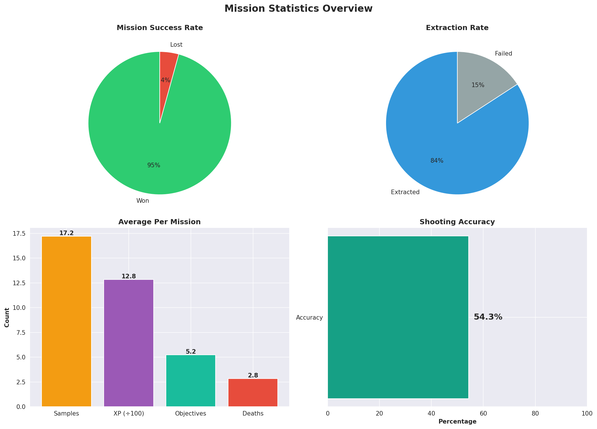
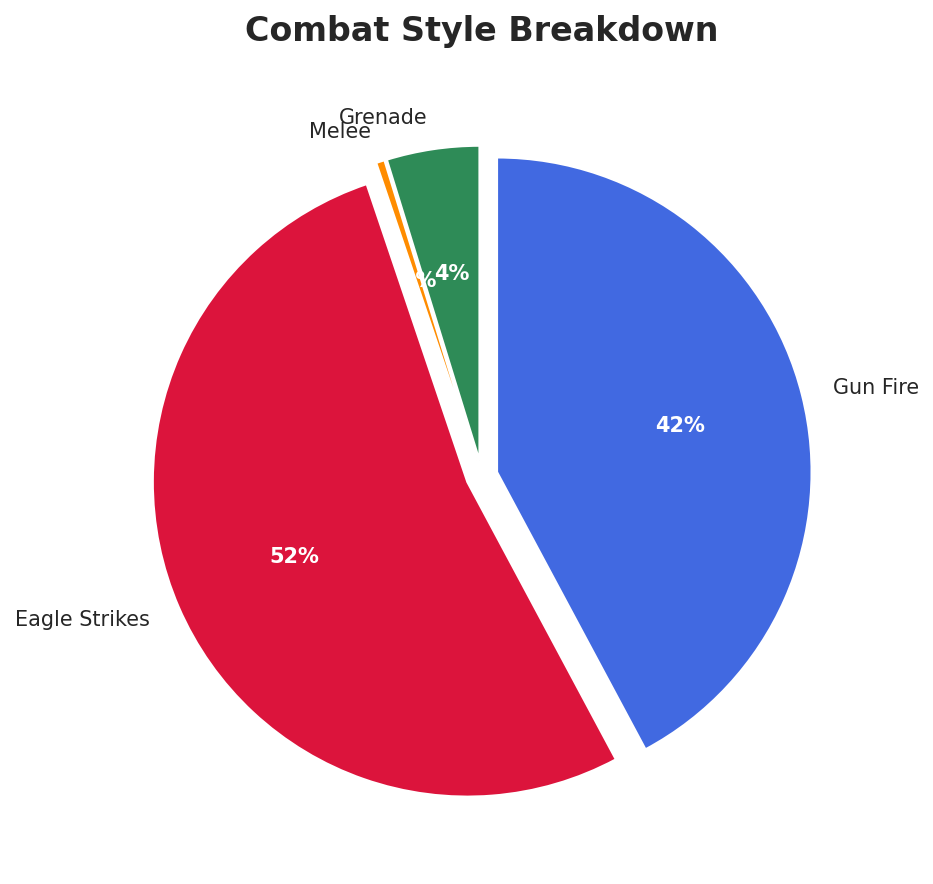
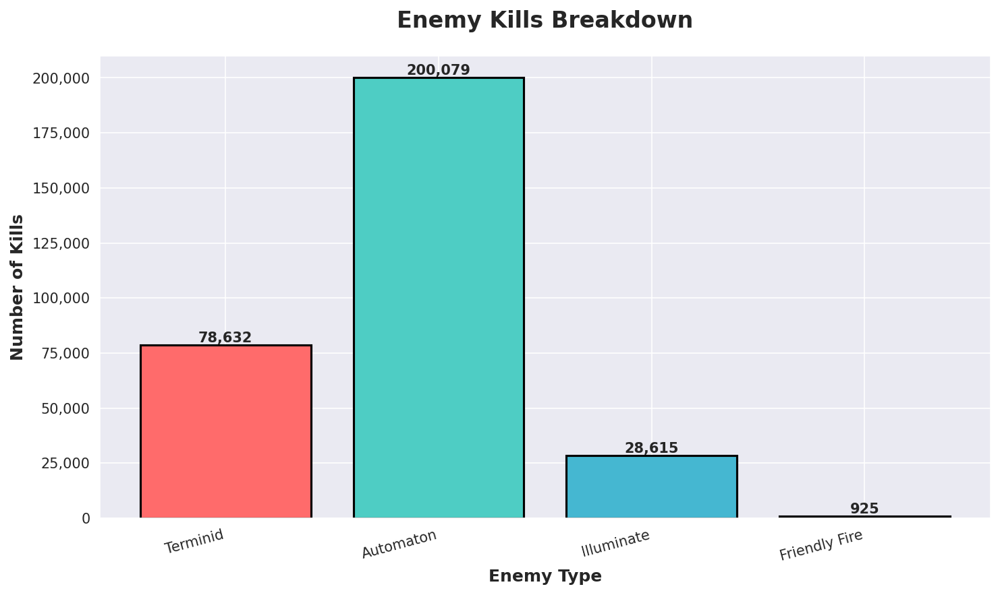
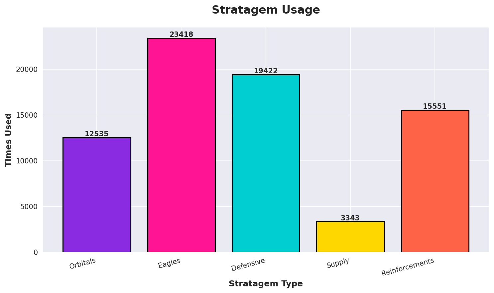

# Helldivers 2 Stats Analyzer

A Python script for analyzing and visualizing Helldivers 2 gameplay statistics.

## Features

- Load stats from CSV files
- Generate beautiful visualizations
- Calculate key performance metrics
- imple single-file script

## Requirements

- Python 3.8+
- Dependencies: pandas, matplotlib, seaborn, numpy

## Installation

1. **Create a virtual environment** (optional):
   ```bash
   python3 -m venv venv
   source venv/bin/activate  # on Windows: venv\Scripts\activate
   ```

2. **Install dependencies**:
   ```bash
   pip install -r requirements.txt
   ```

## Usage

Simply run the script:

```bash
python analyze_stats.py
```

1. Read your stats from `assets/26Feb2025.csv`
2. Calculate statistics and print a summary
3. Generate 4 visualization charts in the `output/` directory:
   - `kill_breakdown.png` - Enemy kills by type
   - `combat_style.png` - Combat method breakdown
   - `mission_stats.png` - Mission performance overview
   - `stratagem_usage.png` - Stratagem usage statistics

## Customization

To analyze a different CSV file, edit `analyze_stats.py`:
```python
csv_file = Path('assets/your_file.csv')
```

## Output Example

```
HELLDIVERS 2 STATISTICS SUMMARY
============================================================

MISSION STATISTICS
• Total Missions: 2,723
• Missions Won: 2,614
• Success Rate: 96.0%
• Extraction Rate: 84.1%

COMBAT STATISTICS
• Total Kills: 307,326
• K/D Ratio: 40.26
• Accuracy: 51.8%

AVERAGES PER MISSION
• XP Earned: 1,153
• Samples: 17.4
• Objectives: 5.0
```


---

---

---

